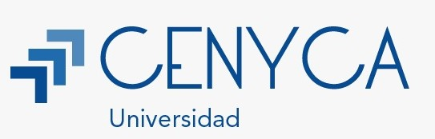

# 👋 ¡Hola! Soy Arce Castellanos Juan Carlos 

  

**🎓 Universidad:** CENYCA UNIVERSIDAD  
**💼 Carrera:** Ingeniería en Sistemas Computacionales 

## 🧑‍💻 Lenguajes de Programación Utilizados
- C++
- C#
- Java

## ⚙️ Programas y Herramientas Utilizadas
- **Compilador de C++**  
- **Android Studio** para el desarrollo de aplicaciones móviles en Java  
- **SQL** para la gestión de bases de datos

## 📩 Contacto
- **Correo:** juanarce45@cenyca.edu.mx

## 🗯️ Proyecto a Realizar
**Proyecto:** diseñar e implementar una aplicación web gamificada para mejorar el aprendizaje de matemáticas en estudiantes de nivel básico.

